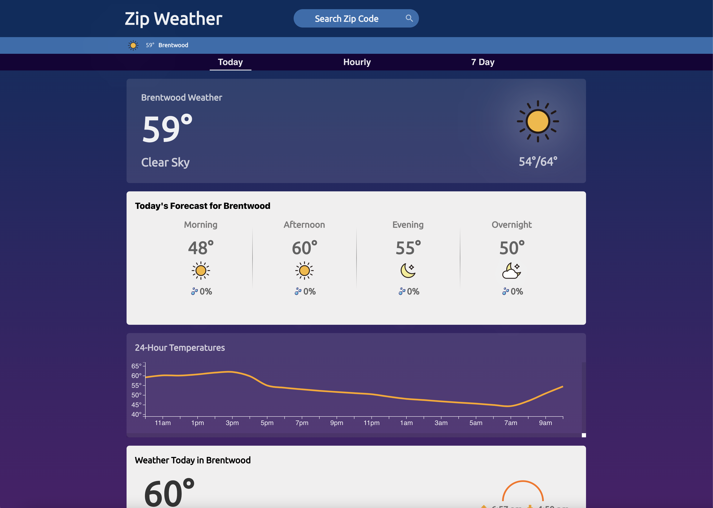
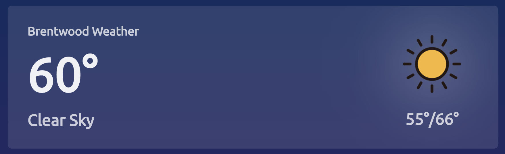
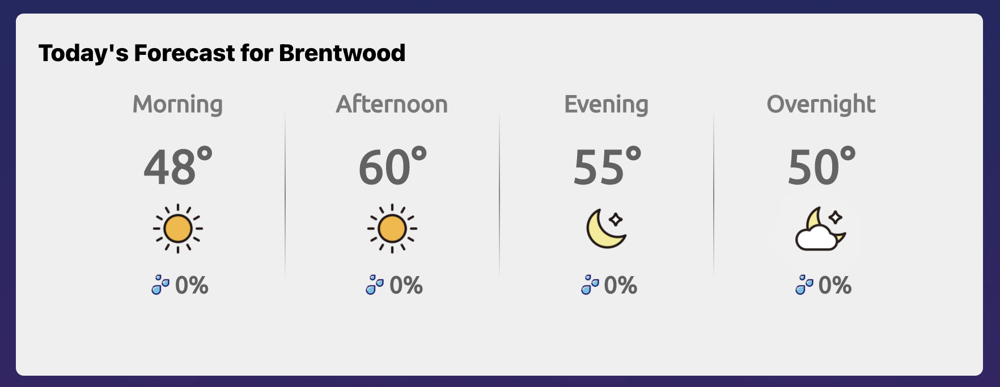
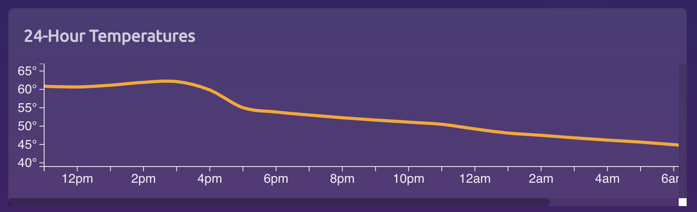
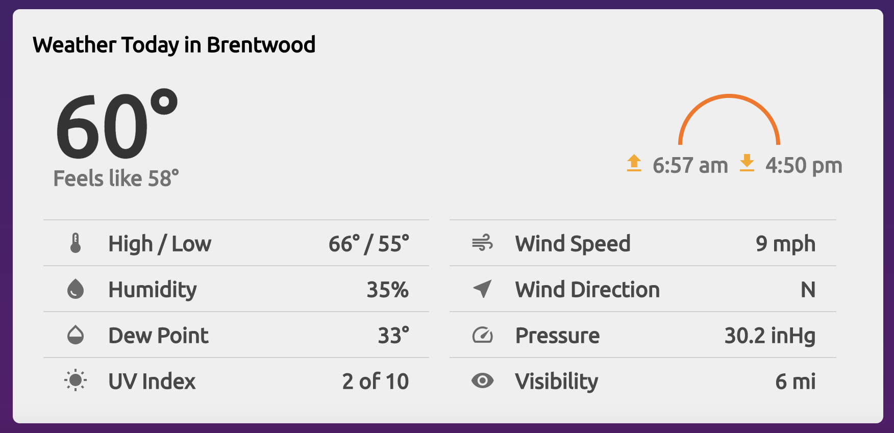
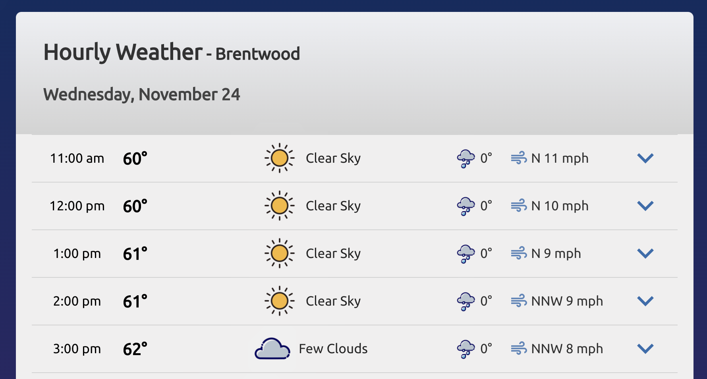
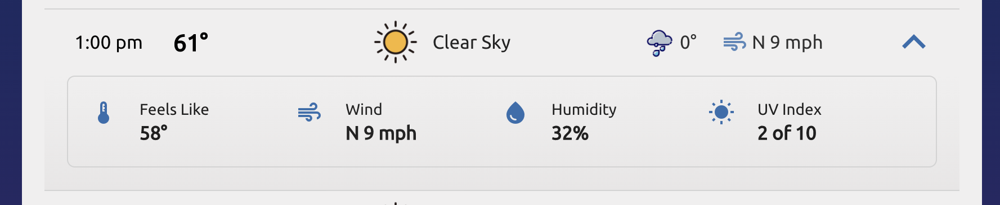
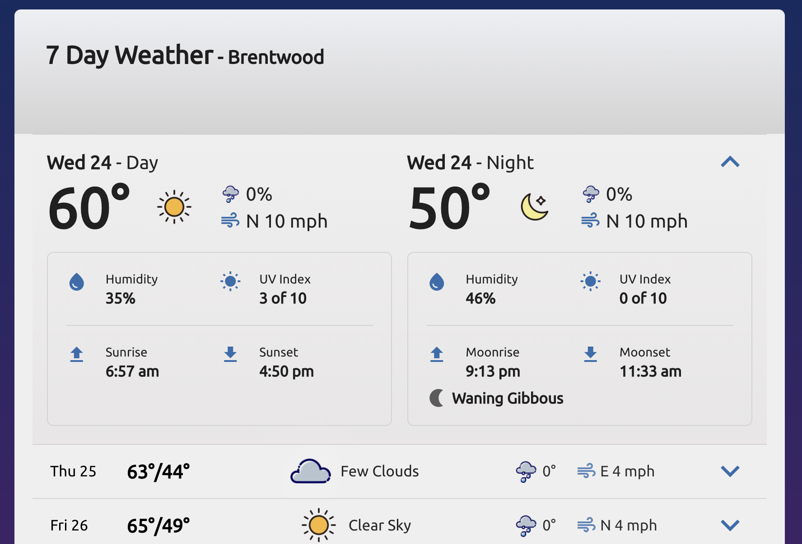

# Zip Weather

### Developed with **React**, **D3** and **Sass** by John Teckemeyer

---

---

## Table Contents

- [Overview](#overview)
- [Website](#website)
- [Features](#features)
  - [The Header](#the-header)
  - [The Menu](#the-menu)
  - [Current Weather](#current-weather)
  - [Today's Forecast](#todays-forecast)
  - [Temperature Forecast](#temperature-forecast)
  - [All Weather Details](#all-weather-details)
  - [24 Hour Forecast](#24-hour-forecast)
  - [7 Day Forecast](#7-day-forecast)
- [Code](#code)
  - [Creating The Gameboard](#creating-the-gameboard)
  - [Exposing The Cells](#exposing-the-cells)

---

---

## Overview

---

_Zip Weather_ is an online application that displays the current weather and 24 hour and 7 day forcasts for a given area. It utilizes the OpenWeather API for the up-to-date data and D3 for the 24 hour temperature line graph. The objective with this application was to further development my skills in React, working with 3rd party data and CSS/Sass. This also gave me the opportunity to use D3 to visualize data, which I have just recently began learning.

---

---

## Website

Check out Zip Weather
[here](https://ziipweather.herokuapp.com/)

---

---

## Features

---

### _The Header_:

  
The header, naturally located at the top of the page, is where the user will find the search bar with which they can input a zipcode for anywhere in the U.S. and get the weather data for that area. The sub-header holds a quick reference to the current weather, temperature and city name for the currently selected zipcode.

---

### _The Menu_:

  
The menu, located right below the header and sub-header, is a simple, responsive and accessible navigation. It only has 3 choices and will always show which page the user is on.

---

### _Current Weather_:

  
The current weather component is pretty simple in that it only shows location, current temperature, high and low temperatures for the day, and the current general weather in both text and icon representation.

---

### _Today's Forecast_:

  
The day's forecast consists of temperature, general weather (represented as an icon) and the chance of percipitation for the four quarters of the day.

---

### _Temperature Forecast_:

  
This component uses D3.js to visualize the change of temperature for the next 24 hours.

---

### _All Weather Details_:

  
The day has more than just temperatures, so this is where all the most popular weather metrics can be found for the day. In the top right, you can also find the sunrise and sunset.

---

### _24 Hour Forecast_:

On the second page, the user can find the weather data for each hour for the next 24 hours. As a default, each hour only shows time, temperature, general weather, chance of percipitation and wind speed and direction.

Upon clicking an hour, the hour component expands and displays more metrics: perceived temperature, humidity and uv index.

---

### _7 Day Forecast_:

  
On the third page can be found the 7 day forecast. Like the 24 hour forecast, each day has a minimized setting with basically the same metrics as the minimized hour forecast. However, upon click the minimized day, it expands and display futher details for both the day and night of that particular date. Both have humidity and uv index, but the day also has sunrise and sunset times and the night has moonrise and moonset times as well as the stage of the moon.

---

---

## Code

---

### _Creating The Gameboard_:

### _Exposing The Cells_:

